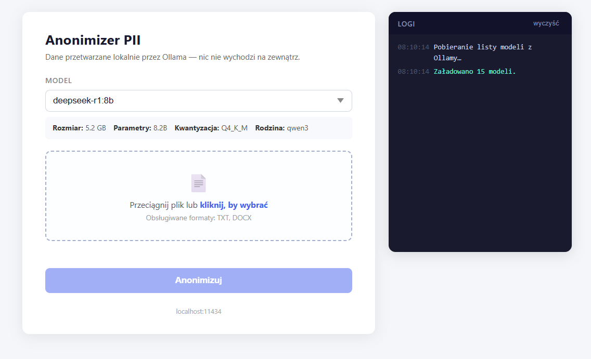

# Anonimizer PII

Lokalne narzędzie do anonimizacji danych osobowych (PII) w dokumentach TXT i DOCX. Działa w całości na Twoim komputerze — żadne dane nie wychodzą na zewnątrz.

Używa lokalnych modeli językowych przez [Ollama](https://ollama.com/).



---

## Funkcje

- Obsługa plików **TXT** i **DOCX** (zachowanie formatowania)
- Wybór modelu LLM z listy dostępnych w Ollama
- Przetwarzanie równoległe — duże dokumenty dzielone na chunki i przetwarzane jednocześnie
- Automatyczne pobieranie zanonimizowanego pliku po zakończeniu
- Interfejs webowy — drag & drop, panel logów, informacje o modelu
- Dwuklik na `main.py` uruchamia serwer i otwiera przeglądarkę

## Obsługiwane placeholdery

| Dane osobowe | Placeholder |
|---|---|
| Imię | `[IMIĘ]` |
| Nazwisko | `[NAZWISKO]` |
| Imię i nazwisko | `[IMIĘ I NAZWISKO]` |
| PESEL | `[PESEL]` |
| NIP | `[NIP]` |
| REGON | `[REGON]` |
| Adres | `[ADRES]` |
| Telefon | `[TELEFON]` |
| E-mail | `[EMAIL]` |
| Data urodzenia | `[DATA URODZENIA]` |
| Nr dowodu osobistego | `[NR DOWODU]` |
| Konto bankowe | `[KONTO BANKOWE]` |
| Nr rejestracyjny | `[NR REJESTRACYJNY]` |

---

## Wymagania

- Python 3.10+
- [Ollama](https://ollama.com/) uruchomiona lokalnie (`ollama serve`)
- Co najmniej jeden pobrany model, np.:

```bash
ollama pull deepseek-r1:8b
```

---

## Instalacja i uruchomienie

```bash
# 1. Sklonuj repozytorium
git clone https://github.com/staniszewskimarek/anonimizer.git
cd anonimizer

# 2. Utwórz środowisko wirtualne i zainstaluj zależności
python -m venv .venv
.venv\Scripts\activate        # Windows
# source .venv/bin/activate   # Linux/macOS

pip install -r requirements.txt

# 3. Uruchom aplikację
python main.py
```

Przeglądarka otworzy się automatycznie pod adresem `http://localhost:8000`.

Alternatywnie (tryb deweloperski z auto-reload):

```bash
uvicorn main:app --reload --port 8000
```

---

## Jak używać

1. Upewnij się, że Ollama działa w tle (`ollama serve`)
2. Uruchom `python main.py`
3. Wybierz model z listy
4. Przeciągnij plik TXT lub DOCX na stronę (lub kliknij, żeby wybrać)
5. Kliknij **Anonimizuj**
6. Zanonimizowany plik zostanie pobrany automatycznie

---

## Struktura projektu

```
anonimizer/
├── main.py           # Serwer FastAPI, endpointy, obsługa DOCX
├── anonymizer.py     # Logika: chunking, wywołania Ollama, prompt
├── index.html        # Frontend (inline CSS/JS, bez frameworków)
└── requirements.txt  # Zależności Python
```

---

## Licencja

MIT — feel free to use, modify, and share.
